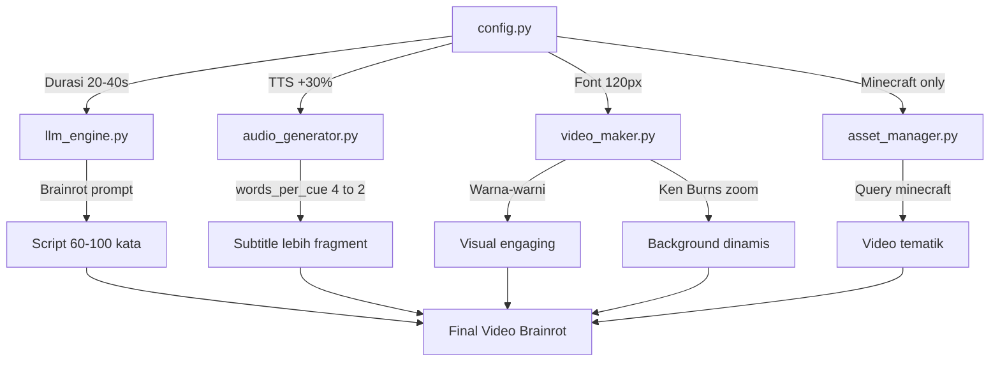

# Rencana Upgrade: Brainrot Style Video

## Masalah Saat Ini
1. **Pace terlalu lambat** — TTS normal speed (+0%), script 120-160 kata untuk 45-60 detik
2. **Konteks aneh** — script finansial serius kurang engaging untuk format brainrot
3. **Background ganti-ganti** — random query tiap run (Minecraft, sand cutting, subway surfers)
4. **Visual plain** — subtitle putih doang, ukuran 70px, no effects

## Target Brainrot Style
- Video 20-40 detik, pace super cepat
- TTS dipercepat (+25% sampai +35%)
- Subtitle BESAR, warna-warni, per 1-2 kata
- Background KONSISTEN: Minecraft parkour terus
- Efek zoom/shake biar dinamis

---

## Perubahan per File

### 1. [`config.py`](youtube_shorts_factory/config.py) — Konfigurasi

| Key | Old Value | New Value | Alasan |
|-----|-----------|-----------|--------|
| `TTS_RATE` | `+0%` | `+30%` | Biar cepet & ngegas ala brainrot |
| `VIDEO_DURATION_SECONDS` | `(45, 60)` | `(20, 40)` | Brainrot harus pendek & padat |
| `SUBTITLE_FONT_SIZE` | `70` | `120` | Biar keliatan & in-your-face |
| `SUBTITLE_STROKE_WIDTH` | `3` | `6` | Outline tebal biar kebaca di video terang |
| `SUBTITLE_Y_POSITION` | `0.65` | Dinamis (0.3-0.7) | Biar gak monoton |
| `BG_VIDEO_QUERIES` | 5 query campur aduk | Cuma Minecraft parkour | Konsisten 1 tema |
| `STORYTELLING_STYLE` | "relatable, storytelling personal..." | "brainrot, fast-paced, absurd, meme references" | Sesuai target |

### 2. [`llm_engine.py`](youtube_shorts_factory/llm_engine.py) — Prompt Script

**Yang diubah:**
- Target kata: 120-160 → **60-100 kata** (20-40 detik di speed +30%)
- Prompt hook: harus **langsung engaging** di 3 detik pertama
- Gaya: absurd, meme references, bahasa campuran yang kocak
- Struktur: **Hook chaos → Relatable struggle → Plot twist → CTA**

**Contoh style baru:**
```
BESTIE LO KIRA GUE BAIK? literally gue punya paylater 5. 
Lima! Satu buat skincare, satu buat sepatu, satu buat... nasi padang.
Ngl, tagihan dateng gue kayak 'siapa ini?' padahal diri sendiri.
Fr, jangan sampe kayak gue. Save this sebelum lo nyesel. #shorts
```

### 3. [`audio_generator.py`](youtube_shorts_factory/audio_generator.py) — Subtitle Grouping

**Yang diubah:**
- `words_per_cue`: `4` → **`2`** (lebih fragment, pace bacanya cepet)
- Efek: subtitle berganti lebih cepat, cocok buat brainrot

### 4. [`video_maker.py`](youtube_shorts_factory/video_maker.py) — Visual Overhaul

**a. Subtitle Warna-Warni**
- Tambah color palette: kuning, hijau neon, orange, pink
- Random color per cue (bisa juga tematik)
- Stroke tetap hitam biar kebaca

**b. Ukuran Font**
- 120px (dari config)
- 1-2 baris max

**c. Dynamic Position**
- Posisi Y bisa naik-turun random biar dinamis
- Atau di bawah untuk 1 baris, tengah untuk kata penting

**d. Ken Burns Effect** (slow zoom on background)
- Background mulai zoom 100% → 110% selama video
- Efek "bergerak" meskipun video diam

**e. Emoji Overlay** (opsional - enhancement)
- Tambah emoji relevan di pojok-pojok
- Misal: 💸💰🔥😱 sesuai konteks

### 5. [`asset_manager.py`](youtube_shorts_factory/asset_manager.py)

**Tidak perlu perubahan kode** — karena query di config sudah diubah ke Minecraft parkour semua.

---

## Prioritas & Tahapan

### 🚀 Tahap 1: Quick Wins (Langsung kerasa bedanya)
| # | Task | File | Estimasi Kompleksitas |
|---|------|------|----------------------|
| 1 | Update config: TTS rate +30%, durasi 20-40 detik | `config.py` | Mudah |
| 2 | Update config: BG_VIDEO_QUERIES → Minecraft parkour only | `config.py` | Mudah |
| 3 | Update config: Font size 120, stroke 6 | `config.py` | Mudah |
| 4 | Update words_per_cue: 4 → 2 | `audio_generator.py` | Mudah |
| 5 | Update script prompt: brainrot style | `llm_engine.py` | Sedang |

### 🎨 Tahap 2: Visual Upgrade
| # | Task | File | Estimasi Kompleksitas |
|---|------|------|----------------------|
| 6 | Subtitle color-warni random | `video_maker.py` | Mudah |
| 7 | Dynamic subtitle Y position | `video_maker.py` | Mudah |
| 8 | Ken Burns zoom effect on background | `video_maker.py` | Sedang |

### ✨ Tahap 3: Brainrot Polish
| # | Task | File | Estimasi Kompleksitas |
|---|------|------|----------------------|
| 9 | Emoji overlay berdasarkan konteks | `video_maker.py` / baru | Sedang |
| 10 | Screen shake effect | `video_maker.py` | Sedang |
| 11 | Test & refine | Pipeline | Berulang |

---

## Flow Diagram Perubahan



---

## Cara Test Hasil

Setelah implementasi, jalankan:
```bash
cd youtube_shorts_factory && .\venv\Scripts\python main.py --run-now
```

Cek hasil video di [`output/videos/`](youtube_shorts_factory/output/videos/) — putar pakai VLC/media player untuk lihat perbedaan visual sebelum diupload.
